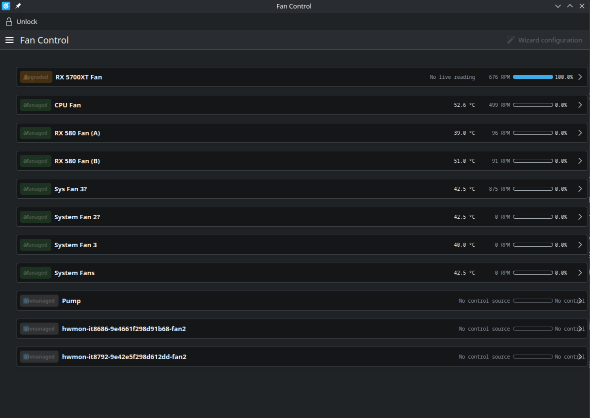
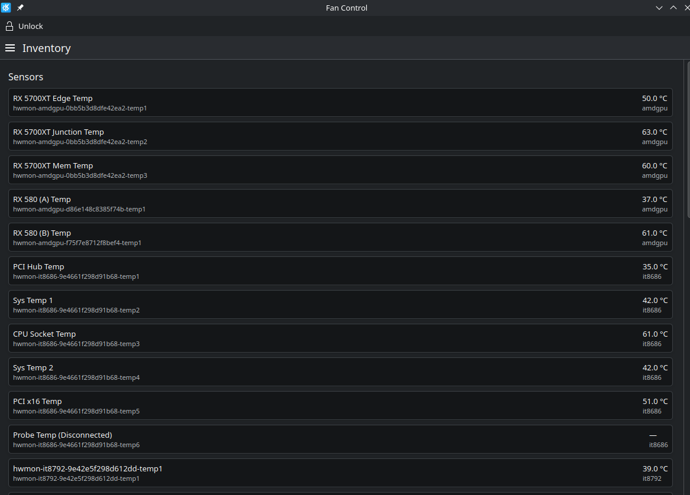
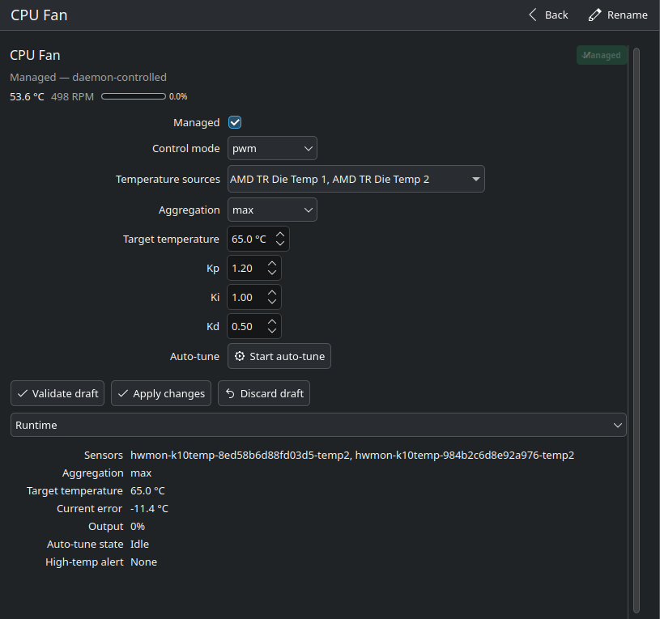
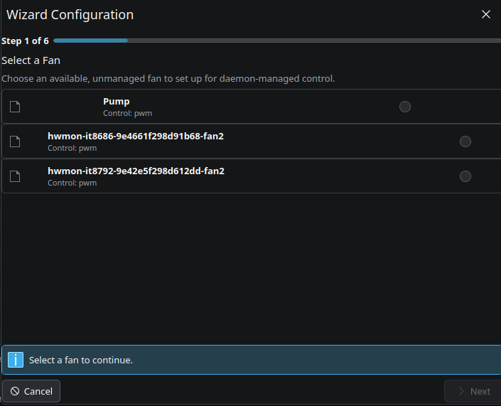
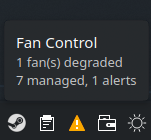
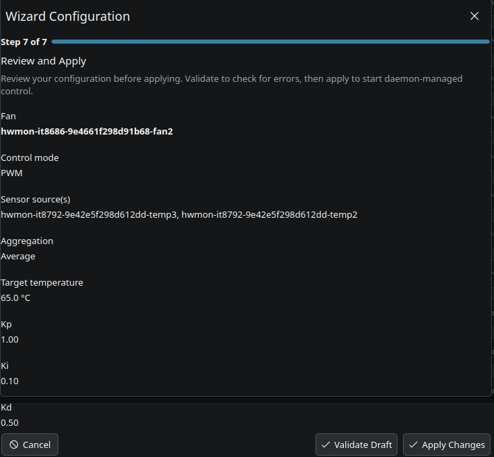
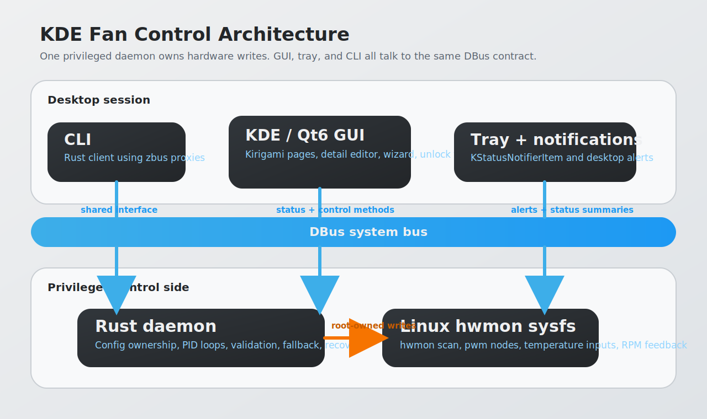
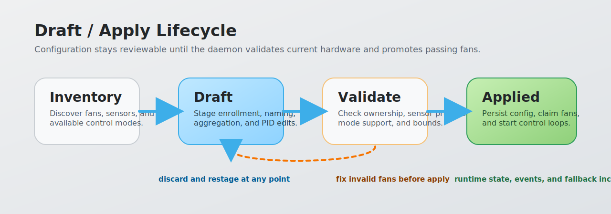
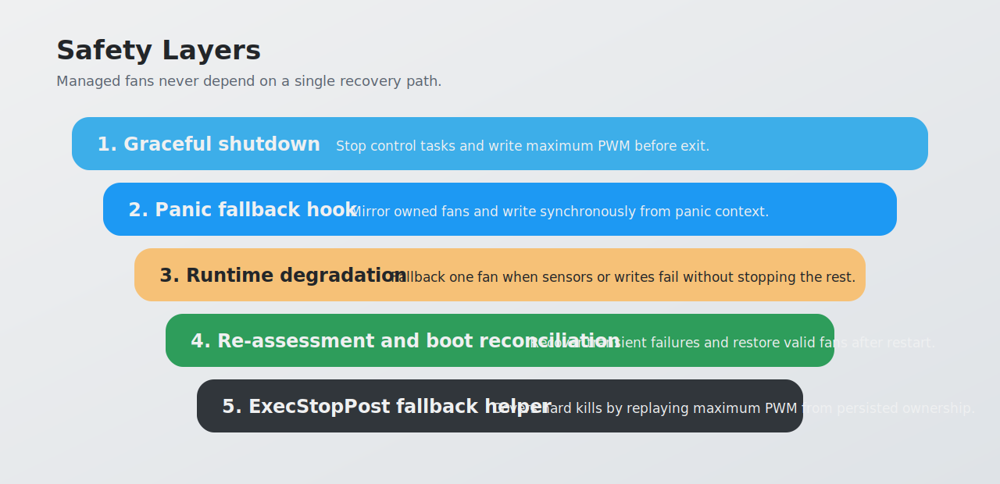

# KDE Fan Control

<p align="center">
  
</p>

<p align="center"><strong>Next-generation KDE fan control for Linux desktops.</strong></p>

KDE Fan Control is a modern fan-control stack for the KDE desktop: a privileged Rust daemon owns hardware writes, runs per-fan PID policies, and exposes one DBus control surface to a KDE/Qt6 GUI, system tray app, and CLI.

It is built for reviewable, safer control. You discover fans and sensors, stage changes in a draft, validate them before they go live, and keep controlled fans on a fail-safe path that drives them to maximum speed if the daemon stops unexpectedly.

## Why It Feels Modern

- Per-fan control with temperature-target PID policies instead of opaque board-level behavior
- Multi-sensor aggregation — combine any number of temperature inputs using avg, max, min, or median so one fan can track the hottest component or the average across a zone
- Draft, validate, and apply workflow instead of direct live mutation
- KDE-native interface with overview, detail pages, wizard setup, tray status, and notifications
- One DBus API shared by GUI and CLI, with read-open access and polkit-gated writes
- Automatic degraded-fan recovery and boot reconciliation after transient failures or restarts

## Interface Preview

<p align="center">
  
</p>

| Overview | Inventory |
|---|---|
|  |  |

| Fan detail | Wizard |
|---|---|
|  |  |

| Tray popover | Apply review |
|---|---|
|  |  |

## Architecture



**DBus bus name:** `org.kde.FanControl`

| Path | Interface | Purpose |
|---|---|---|
| `/org/kde/FanControl` | `org.kde.FanControl.Inventory` | Hardware discovery and friendly naming |
| `/org/kde/FanControl/Lifecycle` | `org.kde.FanControl.Lifecycle` | Draft config, applied config, validation, degraded state, lifecycle events |
| `/org/kde/FanControl/Control` | `org.kde.FanControl.Control` | Runtime control status, PID profile edits, and auto-tune |

## Draft / Apply Flow



The daemon owns the configuration file and is the only process that writes fan-control sysfs nodes. Clients stay stateless and issue DBus calls against one authority.

## Safety Layers



Controlled fans always fail to high speed when the daemon exits, panics, or loses safe control conditions.

- Graceful shutdown writes safe maximum PWM
- Panic fallback mirrors owned fans and writes synchronously from panic context
- Runtime degradation drives affected fans to fallback and keeps the rest running
- Re-assessment recovers transiently degraded fans automatically
- Boot reconciliation restores valid applied fans after restart
- `ExecStopPost` fallback covers hard kills such as `SIGKILL`

## Highlights

- Hardware inventory from Linux kernel hwmon sysfs at `/sys/class/hwmon/hwmon*`
- Per-fan enrollment with explicit draft, validate, and apply lifecycle
- Temperature-target PID control with configurable gains, cadence, limits, and deadband
- Multi-sensor aggregation with `avg`, `max`, `min`, and `median`
- Auto-tune proposals with bounded observation windows and explicit acceptance
- Friendly names for fans and sensors
- KDE-native GUI with overview, inventory, fan detail pages, wizard setup, tray, and notifications
- Read-open and write-privileged DBus access via polkit with UID-0 fallback
- Safe-maximum fallback, fallback incident persistence, and degraded-fan recovery

## Quick Start

### Prerequisites

- Rust toolchain (stable, edition 2024)
- Qt 6.8+ development packages: Core, Quick, Qml, QuickControls2, DBus, Widgets
- KDE Frameworks 6 packages: Kirigami, StatusNotifierItem, Notifications, I18n
- CMake 3.20+
- `libclang` for Rust bindgen when building with `udev`

### Build

```sh
# Rust daemon + CLI
cargo build --release

# KDE GUI
cmake -B gui/build -S gui
cmake --build gui/build
```

### Run

```sh
# Daemon (requires root, system bus by default)
sudo ./target/release/kde-fan-control-daemon

# Daemon on session bus (development)
./target/release/kde-fan-control-daemon --session-bus

# GUI
./gui/build/kde-fan-control-gui

# CLI
./target/release/kde-fan-control inventory
./target/release/kde-fan-control state
```

### Local Installed-Style Testing

```sh
cargo build --release
cmake -B gui/build -S gui
cmake --build gui/build
sudo ./scripts/dev-install.sh install --release
sudo systemctl enable --now kde-fan-control-daemon
```

This installs the desktop file, icon assets, polkit policy, DBus files, and a dev systemd unit for local testing. Remove them with `sudo ./scripts/dev-install.sh uninstall`.

## CLI Snapshot

| Command | Description |
|---|---|
| `inventory` | List detected sensors and fans |
| `rename <id> <name>` | Assign a friendly name to a sensor or fan |
| `draft` | Show the current staged configuration |
| `applied` | Show the current live configuration |
| `degraded` | Show degraded fan summary with reasons |
| `events` | Show recent lifecycle events |
| `enroll <fan_id>` | Stage fan enrollment |
| `control set <fan_id>` | Stage PID profile changes |
| `validate` | Validate the draft without applying it |
| `apply` | Promote the draft configuration to live |
| `state` | Show runtime state for all fans |
| `auto-tune start <fan_id>` | Start a bounded auto-tune run |

Most commands accept `--format json`, and many accept `--detail` for expanded output.

## Documentation

| Document | Content |
|---|---|
| [docs/building.md](docs/building.md) | Build prerequisites, local install flow, development runs |
| [docs/developer-install.md](docs/developer-install.md) | Paths and behavior for `scripts/dev-install.sh` |
| [docs/architecture.md](docs/architecture.md) | Internal structure, control loops, privilege boundary |
| [docs/dbus-api.md](docs/dbus-api.md) | DBus interface contract |
| [docs/configuration.md](docs/configuration.md) | Config schema, draft/apply model, examples |
| [docs/safety-model.md](docs/safety-model.md) | Fallback behavior, degraded-state recovery, boot reconciliation |
| [docs/SECURITY.md](docs/SECURITY.md) | Security analysis and remediation notes |
| [CHANGELOG.md](CHANGELOG.md) | Release history |

## Project Status

**v1.0.2 shipped** on 2026-04-14.

Current release highlights:

- packaged icon naming aligned with `org.kde.fancontrol`
- refreshed architecture, lifecycle, and safety diagrams
- prior `v1.0.1` systemd, polkit, and fallback hardening improvements remain included

## License

GPL-3.0-or-later
